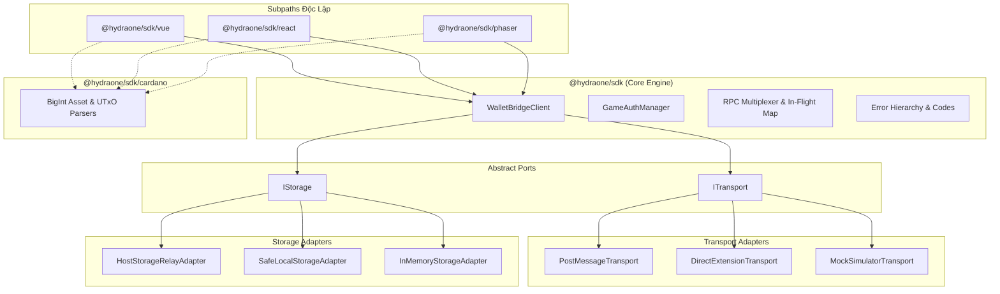

# Architecture Spine — @hydraone/sdk

## 1. Design Paradigm

Kiến trúc chủ đạo của **`@hydraone/sdk`** là **Hexagonal Architecture (Ports and Adapters)**.

* **Core Domain / Engine**: Thuần TypeScript, zero-dependency. Đóng gói trạng thái ví, cỗ máy RPC Request/Response, quản lý vòng đời Auth và kiểm soát lỗi. Core hoàn toàn độc lập với các API môi trường trình duyệt (`window`, `postMessage`, `localStorage`) cũng như các UI framework (Vue, React, Phaser).
* **Ports (Interfaces chuẩn của Core)**:
  * `ITransport`: Trừu tượng hóa việc gửi và nhận bản tin bất đồng bộ.
  * `IStorage`: Trừu tượng hóa việc lưu trữ cặp khóa - giá trị.
  * *Mở rộng trong tương lai*: `ILogger`, `IClock`, `ICrypto`.
* **Adapters (Hiện thực hóa hạ tầng)**:
  * *Transport Adapters*: `PostMessageTransport` (chạy trong iframe), `DirectExtensionTransport` (chạy ngoài iframe với `window.cardano`), `MockSimulatorTransport` (chạy dev/test).
  * *Storage Adapters*: `HostStorageRelayAdapter` (ủy quyền Host lưu), `SafeLocalStorageAdapter` (bọc try-catch chống exception), `InMemoryStorageAdapter` (RAM fallback).
  * *Framework Consumer Adapters*: `@hydraone/sdk/vue`, `@hydraone/sdk/react`, `@hydraone/sdk/phaser`.



---

## 2. Invariants & Rules

### AD-1 — Hexagonal Ports & Adapters Isolation
- **Binds:** Toàn bộ mã nguồn `@hydraone/sdk`
- **Prevents:** Sự phụ thuộc chéo (tight-coupling) giữa logic RPC ví và môi trường runtime; ngăn chặn việc biến Core thành "God Object".
- **Rule:** 
  1. Thư mục `src/core/` tuyệt đối không import bất kỳ API nào từ `window`, `document`, DOM events, `localStorage`, `vue`, `react`, hay `phaser`.
  2. Mọi giao tiếp ra ngoài môi trường phải thông qua Ports (`ITransport`, `IStorage`).
  3. Core Engine có thể chạy và pass 100% unit tests trong môi trường Node.js thuần (không cần jsdom hay browser context).

### AD-2 — RPC Multiplexing via Unique Request ID and In-Flight Lifecycle Map
- **Binds:** `ITransport`, `WalletBridgeClient`, RPC Dispatcher
- **Prevents:** Xung đột phản hồi khi gọi nhiều RPC đồng thời (race conditions); mất dấu request khi response trả về không theo thứ tự (out-of-order); rò rỉ bộ nhớ (memory leaks) do dangling promises.
- **Rule:**
  1. Mọi bản tin RPC gửi đi bắt buộc có `requestId` duy nhất (chuỗi định danh ngẫu nhiên va chạm bằng không).
  2. `InFlight Map` theo dõi trạng thái từng request theo máy trạng thái hữu hạn (FSM):
     `Pending -> Fulfilled | Rejected | TimedOut | Cancelled | TransportFailed`.
  3. Khi timeout kích hoạt:
     - Promise lập tức bị reject với `HydraTimeoutError`.
     - Entry trong Map bị dọn dẹp ngay để giải phóng bộ nhớ.
     - Mọi bản tin phản hồi muộn (late/stale response) đến sau khi timeout đều bị bỏ qua (silent drop) kèm log cảnh báo ở chế độ debug.
  4. Cấu hình Timeout mặc định theo phân tầng (có thể override per-request):
     - `Handshake / Ping`: 3,000 ms
     - `Queries / Status Sync`: 15,000 ms
     - `Signing / User Decisions`: 120,000 ms

### AD-3 — Tiered Storage with Granular Sub-namespaces and Failure Semantics
- **Binds:** `IStorage`, Auth & Session Management
- **Prevents:** Mất phiên đăng nhập trên Safari iOS; rò rỉ dữ liệu nhạy cảm ra unpartitioned storage; xung đột hoặc ghi đè dữ liệu riêng của Game.
- **Rule:**
  1. **Storage Policy & Fallback**:
     - *Dữ liệu phiên làm việc (Session/Token)*: Ưu tiên ghi qua `HostStorageRelayAdapter`. Nếu Host disconnect/fail, ném lỗi có kiểm soát thay vì tự động ghi token nhạy cảm vào unpartitioned storage không an toàn.
     - *Dữ liệu khả dụng tạm thời (Non-sensitive / UI Cache)*: Fallback xuống `SafeLocalStorageAdapter` -> `InMemoryStorageAdapter`.
     - Bộ nhớ RAM (`InMemoryStorageAdapter`) chỉ đóng vai trò **Availability Fallback** trong suốt phiên sống của tab, không được xem là Persistence.
  2. **Sub-namespace Phân định**:
     - Dữ liệu Auth: `hydra:sdk:auth:*`
     - Dữ liệu Session & State: `hydra:sdk:session:*`
  3. Lệnh `storage.clear()` chỉ được phép quét và xóa các key khớp với pattern `hydra:sdk:*`, bảo toàn 100% dữ liệu khác của Game origin.

### AD-4 — Tách biệt Tiện ích Cardano Domain sang `@hydraone/sdk/cardano`
- **Binds:** `@hydraone/sdk/cardano`, Framework Adapters
- **Prevents:** Làm phình to Core Engine thành một thư viện tiện ích Cardano; sai số số học dấu phẩy động (floating point precision loss) khi xử lý tiền tệ crypto.
- **Rule:**
  1. Core Engine `@hydraone/sdk` không chứa logic tính toán UTxO hay parse tài sản Cardano.
  2. Toàn bộ logic tính toán tài sản được đóng gói tại subpath `@hydraone/sdk/cardano`.
  3. Mọi phép toán liên quan đến Lovelace và số lượng token bắt buộc dùng kiểu dữ liệu **`bigint`** nguyên thủy, tuyệt đối không dùng `number`:
     - `getTotalLovelace(utxos: unknown[]): bigint`
     - `getAdaBalance(utxos: unknown[]): bigint`
     - `getAssetQuantity(utxos: unknown[], policyId: string, assetName: string): bigint`

### AD-5 — Zero-Trust Cross-Origin Security Contract
- **Binds:** `PostMessageTransport`, Host & Client Handshake
- **Prevents:** Giả mạo chữ ký ví từ iframe hoặc parent window độc hại; clickjacking; replay attacks.
- **Rule:**
  1. `PostMessageTransport` bắt buộc kiểm tra `event.origin === configuredAppCenterOrigin`.
  2. Không cho phép dùng wildcard `'*'` ở môi trường production (ném ngoại lệ `HydraSecurityError`).
  3. Khi chạy trong iframe, chỉ chấp nhận bản tin từ `event.source === window.parent`.
  4. Mọi bản tin phản hồi phải khớp chính xác `requestId` đang chờ trong In-Flight Map.

### AD-6 — Cây Lỗi Thống Nhất (Unified Error Hierarchy) & Stable Error Codes
- **Binds:** Toàn bộ public API surfaces
- **Prevents:** Lỗi không rõ nguyên nhân (`new Error("failed")`), khiến lập trình viên 3rd-party không thể bắt và xử lý lỗi cụ thể.
- **Rule:**
  1. Mọi lỗi phát sinh từ SDK đều kế thừa từ `HydraBridgeError` với 2 thuộc tính chuẩn: `code: string` và `details?: unknown`.
  2. Bảng mã lỗi định danh chuẩn:
     - `ERR_TIMEOUT`: Hết thời gian chờ phản hồi từ Host/Ví.
     - `ERR_USER_REJECTED`: Người chơi từ chối ký hoặc hủy giao dịch trên ví.
     - `ERR_NOT_IN_IFRAME`: SDK chạy trong ngữ cảnh không có Host và không bật fallback extension.
     - `ERR_UNTRUSTED_ORIGIN`: Bản tin đến từ origin không hợp lệ.
     - `ERR_AUTH_EXPIRED`: Phiên xác thực JWT hết hạn.
     - `ERR_STORAGE_UNAVAILABLE`: Không thể lưu trữ dữ liệu phiên an toàn.

### AD-7 — Cấu trúc Đóng gói Đa Subpath & PeerDependencies Độc lập
- **Binds:** `package.json`, `tsup.config.ts`, `tsconfig.json`
- **Prevents:** Rò rỉ phụ thuộc giữa các framework (Framework Leaking); vỡ bundle khi game không dùng Vue hoặc React.
- **Rule:**
  1. Cấu hình `exports` trong `package.json` cho từng subpath rõ ràng:
     - `.` -> Core Engine
     - `./cardano` -> Cardano Pure Utilities
     - `./vue` -> Vue 3 Composables
     - `./react` -> React 18+ Hooks & Provider
     - `./phaser` -> Phaser 3 Event Bridge
     - `./simulator` -> Mock Host & DevTools UI
     - `./diagnostics` -> Health Check Suite
  2. Toàn bộ UI frameworks đều khai báo ở `peerDependencies` dạng `optional: true`:
     - `"vue": ">=3.0.0"`
     - `"react": ">=18.0.0"`
     - `"phaser": ">=3.60.0"`

---

## 3. Consistency Conventions

| Lĩnh vực | Quy ước chuẩn |
| :--- | :--- |
| **Đặt tên File & Thư mục** | Kebab-case cho files/dirs (`wallet-bridge-client.ts`, `host-storage-relay.ts`); PascalCase cho Classes/Types (`WalletBridgeClient`, `ITransport`). |
| **Cấu trúc Bản tin (Message Envelope)** | `{ id: string, type: BridgeMessageType, payload?: unknown, timestamp: number, source: 'hydra-client' \| 'hydra-host' }` |
| **Cấu trúc Lỗi (Error Shape)** | `{ name: string, code: string, message: string, details?: unknown, stack?: string }` |
| **Đơn vị Tiền tệ & Số học** | Lovelace và Token Amounts luôn luôn là `bigint` (kết thúc bằng `n` hoặc biểu diễn chuỗi số nguyên khi serialize qua JSON). |
| **Tiền tố Namespace Storage** | Bắt buộc `hydra:sdk:*` (ví dụ `hydra:sdk:auth:token`). |

---

## 4. Technology Stack (Seed)

| Thành phần | Công nghệ | Phiên bản | Ghi chú |
| :--- | :--- | :--- | :--- |
| **Language** | TypeScript | `^5.7.0` | Strict mode bật 100% |
| **Build Tool** | `tsup` (esbuild) | `^8.0.0` | Xuất ESM + CJS + DTS đa entrypoints |
| **Package Manager** | `pnpm` | `^10.0.0` | Quản lý dependencies nghiêm ngặt |
| **Test Framework** | `vitest` | `^2.0.0` | Chạy unit test Core với tốc độ cao |
| **Target Runtime** | Node 18+ / Modern Browsers | ES2022 | Hỗ trợ Native BigInt & Optional Chaining |

---

## 5. Structural Seed (Source Tree)

```text
hydraone-sdk/
├── src/
│   ├── core/                    # Core Engine (Zero-dependency)
│   │   ├── client.ts            # WalletBridgeClient
│   │   ├── auth.ts              # GameAuthManager
│   │   ├── errors.ts            # HydraBridgeError hierarchy & codes
│   │   ├── types.ts             # Envelopes & protocol types
│   │   ├── ports/               # Abstract Ports (ITransport, IStorage)
│   │   └── adapters/            # Transport & Storage Adapters
│   ├── cardano/                 # Subpath: @hydraone/sdk/cardano
│   │   ├── assets.ts            # BigInt Lovelace & Asset Parsers
│   │   └── index.ts
│   ├── vue/                     # Subpath: @hydraone/sdk/vue
│   │   ├── composables.ts       # useWalletBridgeClient, useGameAuth
│   │   └── index.ts
│   ├── react/                   # Subpath: @hydraone/sdk/react
│   │   ├── provider.tsx         # HydraOneProvider
│   │   ├── hooks.ts             # useWallet, useAuth
│   │   └── index.ts
│   ├── phaser/                  # Subpath: @hydraone/sdk/phaser
│   │   ├── plugin.ts            # HydraBridgePlugin
│   │   └── index.ts
│   ├── simulator/               # Subpath: @hydraone/sdk/simulator
│   │   ├── mock-host.ts         # MockBridgeHost
│   │   ├── devtools-ui.ts       # Floating DevTools Widget
│   │   └── index.ts
│   ├── diagnostics/             # Subpath: @hydraone/sdk/diagnostics
│   │   ├── health-check.ts      # bridge.checkHealth()
│   │   └── index.ts
│   └── index.ts                 # Main entrypoint export
├── package.json
├── tsconfig.json
├── tsup.config.ts
└── vitest.config.ts
```

---

## 6. Capability → Architecture Map

| Yêu cầu PRD (Capability) | Thành phần hiện thực | Quyết định Kiến trúc chi phối |
| :--- | :--- | :--- |
| **FR-1: Core Wallet RPC** | `src/core/client.ts`, `ports/transport.ts` | **AD-1, AD-2, AD-5** |
| **FR-2: Web3 Auth & Session** | `src/core/auth.ts` | **AD-3, AD-6** |
| **FR-3: Dual Storage & Safari ITP** | `src/core/adapters/storage/` | **AD-3** |
| **FR-4: Game Lifecycle** | `src/core/client.ts` | **AD-2, AD-5** |
| **FR-5: Framework Adapters** | `src/vue/`, `src/react/`, `src/phaser/` | **AD-1, AD-4, AD-7** |
| **FR-6: Simulator & Diagnostics** | `src/simulator/`, `src/diagnostics/` | **AD-1, AD-6** |
| **FR-7: Developer Docs & Types** | `dist/*.d.ts`, `docs/` | **AD-7** |

---

## 7. Deferred (Các quyết định tạm hoãn)

1. **Hydra State Channel Off-Chain Instant Bets**: Tạm hoãn đến khi giao thức Hydra Head trên App Center ổn định production.
2. **In-Game Token Swap Engine**: Tránh làm phình to SDK v1.0; dev game sẽ dùng URL redirect hoặc Host Overlay Modal cơ bản.
3. **Pluggable Encryption Port (`ICrypto`)**: v1.0 sử dụng Web Crypto API tiêu chuẩn (`window.crypto.subtle`) cho Blake2b/SHA-256; chưa cần abstracting crypto provider cho native hardware wallets.
