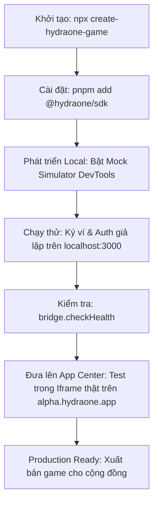

# PRD: @hydraone/sdk — Official Game & dApp Developer Toolkit

## 1. Tóm lược Dự án & Tầm nhìn (Executive Summary & Vision)

### 1.1 Bối cảnh
Nền tảng **HydraOne** là trung tâm phân phối Game và dApp Web3 xây dựng trên nền tảng **Cardano & Hydra Layer 2**. Để đảm bảo tính độc lập, an toàn và dễ dàng mở rộng, toàn bộ các trò chơi của bên thứ ba (3rd-party game dApps) đều được tải động bên trong các **cross-origin `<iframe>`**. 

Tuy nhiên, kiến trúc micro-frontend này tạo ra hai thách thức kỹ thuật lớn:
1. **Rào cản Same-Origin Policy**: Các ví Cardano extension (Eternl, Lace, Nami, Flint...) không thể inject API `window.cardano` trực tiếp vào iframe khác domain.
2. **Safari ITP (Intelligent Tracking Prevention) & Storage Partitioning**: Trình duyệt Safari trên iOS/macOS chặn cookie và `localStorage` của bên thứ ba trong iframe, dẫn đến việc người chơi liên tục bị mất phiên đăng nhập (logout) khi tải lại trang.

### 1.2 Tầm nhìn Sản phẩm (Product Vision)
**`@hydraone/sdk`** là bộ công cụ lập trình chính thức (Official SDK) do HydraOne phát hành mã nguồn mở (Open Source trên Public NPM), đóng vai trò cầu nối toàn diện giúp bất kỳ lập trình viên Web3 Frontend hay Game Studio nào cũng có thể **kết nối ví, xác thực người chơi và đưa game lên nền tảng HydraOne trong vòng dưới 30 phút**.

---

## 2. Chân dung Lập trình viên Mục tiêu (Target Developer Persona)

* **Đối tượng chính (Primary Persona)**: **Web3 Frontend Developers & Game Engineers**
  * **Công nghệ chủ đạo**: React/Next.js, Vue 3/Nuxt 3, TypeScript, Phaser 3, PixiJS.
  * **Đặc điểm**: Đã có kinh nghiệm làm giao diện Web hoặc gameplay, hiểu cơ bản về ví crypto nhưng **không muốn phải tự viết các giao thức RPC cấp thấp, không muốn tự xử lý thuật toán mã hóa CBOR/CIP-8 hay đau đầu với lỗi Safari ITP**.
  * **Nhu cầu cốt lõi**: Cần các Hook / Composable đơn giản, trả về State reactive (địa chỉ ví, số dư, trạng thái kết nối), tự do thiết kế UI 100% (Headless), có bộ Simulator để chạy thử ngay trên `localhost` mà không cần deploy lên server thật.

---

## 3. Triết lý Thiết kế & Định vị Sản phẩm

1. **Headless & Logic-First**: SDK không áp đặt bất kỳ giao diện (UI) nào lên game. Mọi nút bấm, popup hay phong cách đồ họa do lập trình viên game tự làm chủ để ăn khớp với art style của game.
2. **Gói duy nhất, xuất khẩu đa đường dẫn (Monolithic Package with Subpaths)**:
   * Nhà phát triển chỉ cài một gói duy nhất: `pnpm add @hydraone/sdk`
   * Import linh hoạt theo công nghệ:
     * `@hydraone/sdk` (Core TypeScript Client, framework-agnostic)
     * `@hydraone/sdk/vue` (Composables cho Vue 3 / Nuxt 3)
     * `@hydraone/sdk/react` (Hooks & Context Provider cho React / Next.js)
     * `@hydraone/sdk/phaser` (Event Bus Adapter cho Phaser 3)
     * `@hydraone/sdk/simulator` (Interactive DevTools & Mock Host)
     * `@hydraone/sdk/diagnostics` (Kiểm tra sức khỏe kết nối Bridge)
3. **Phòng vệ rủi ro tận gốc (Zero-Fail Storage)**: Giải quyết dứt điểm vấn đề mất session Safari iOS thông qua cơ chế Host Storage Relay.

---

## 4. Mục tiêu Đo lường Thành công (Success Metrics & Counter-Metrics)

### 4.1 Chỉ số Thành công (Success Metrics)
* ⏱️ **Time-to-First-Transaction (TTFT) < 30 phút**: Một lập trình viên mới có thể cài đặt SDK, cấu hình và thực hiện lệnh ký ví thử nghiệm đầu tiên thành công trong dưới 30 phút.
* 🛡️ **Tỷ lệ duy trì phiên trên Safari iOS đạt 100%**: Loại bỏ hoàn toàn tình trạng văng session đăng nhập khi người dùng Safari iOS reload hoặc đóng mở lại iframe.
* 📦 **Dung lượng Core gzipped < 12 KB**: Không làm ảnh hưởng đến tốc độ tải và FPS của game.
* 🩺 **Tỷ lệ chẩn đoán đúng lỗi (Error Clarity) đạt 100%**: Mọi lỗi RPC (người dùng từ chối ký, timeout, sai origin) đều trả về Custom Typed Error rõ ràng kèm mã lỗi và hướng dẫn khắc phục.

### 4.2 Chỉ số Đo lường Ngược (Counter-Metrics)
* Không làm tăng thời gian khởi động (First Meaningful Paint) của game quá 50ms khi khởi tạo SDK.
* Không đưa các thư viện WASM nặng vào Core Client để tránh phình to bundle của 3rd-party devs.

---

## 5. Yêu cầu Chức năng (Functional Requirements - FRs)

### FR-1: Core Wallet RPC & CIP-30 Protocol
* **FR-1.1**: Cung cấp đầy đủ các phương thức đọc trạng thái ví theo chuẩn CIP-30: `getUsedAddresses()`, `getUtxos()`, `getBalance()`, `getCollateral()`.
* **FR-1.2**: Cung cấp phương thức ký giao dịch `signTx(cbor, partialSign)` và nộp giao dịch `submitTx(cbor)`.
* **FR-1.3**: Hỗ trợ ký xác thực thông điệp theo chuẩn CIP-8 `signData(address, payloadHex)`.
* **FR-1.4 (Tiered Timeouts)**: Tự động phân bổ timeout tối ưu theo loại tác vụ (Ping: 3s, Queries: 15s, Ký ví: 120s) và hỗ trợ override per-request.
* **FR-1.5 (Standalone Fallback)**: Tự động phát hiện khi game chạy độc lập ngoài iframe và kết nối trực tiếp với ví trình duyệt `window.cardano` (Eternl, Lace...) nếu được cấu hình `fallbackToExtension: true`.

### FR-2: Web3 Authentication & Session Management
* **FR-2.1**: Tích hợp module `GameAuthManager` chuẩn hóa quy trình đăng nhập 1-click qua CIP-8.
* **FR-2.2**: Tự động mã hóa hex payload, lưu trữ JWT token an toàn và tự động kiểm tra thời hạn hết hạn (`isJwtExpired`).
* **FR-2.3**: Phát sự kiện `AUTH_STATE_CHANGED` khi phiên đăng nhập thay đổi hoặc hết hạn.

### FR-3: Resilient Dual Storage & Safari ITP Host Relay
* **FR-3.1 (In-Memory Fallback)**: Tự động chuyển sang lưu trên RAM khi `localStorage` bị ném `SecurityError` do trình duyệt chặn bên thứ ba.
* **FR-3.2 (Host Storage Relay)**: Cung cấp các hàm `getItemAsync`, `setItemAsync`, `removeItemAsync` ủy quyền việc lưu trữ token và game state sang Host Shell của App Center.
* **FR-3.3 (Key Namespace Isolation)**: Toàn bộ key SDK quản lý đều có tiền tố mặc định `hydra:*`. Khi gọi lệnh `storage.clear()`, SDK tuyệt đối không xóa các dữ liệu riêng của game (như save game, high score, setting âm thanh).

### FR-4: Game Lifecycle & Host Events Synchronization
* **FR-4.1 (Ready Handshake)**: Thực hiện bắt tay hai chiều giữa Iframe và Host Shell (`CLIENT_READY` ⇄ `HOST_ACK`).
* **FR-4.2 (Audio Sync)**: Lắng nghe sự kiện `AUDIO_MUTED_CHANGED` từ thanh điều khiển của Host để game tự động bật/tắt nhạc nền.
* **FR-4.3 (Theme & Display)**: Đồng bộ giao diện Dark/Light qua `THEME_CHANGED`.
* **FR-4.4 (Device Controls)**: Cho phép game yêu cầu khóa hướng màn hình (`setOrientation`) và rung phản hồi xúc giác (`triggerHaptic`).
* **FR-4.5 (Host Modal Request)**: Cho phép game yêu cầu Host mở popup nạp tiền (`requestDepositModal`) hoặc lấy thông tin người chơi (`getPlayerProfile`).

### FR-5: Headless Framework Adapters
* **FR-5.1 (Vue 3 / Nuxt 3)**: Xuất khẩu subpath `@hydraone/sdk/vue` chứa `useWalletBridgeClient` và `useGameAuth` trả về các Vue reactive `ref`s và computed helpers (`shortAddress`, `isMainnet`).
* **FR-5.2 (React / Next.js)**: Xuất khẩu subpath `@hydraone/sdk/react` chứa `<HydraOneProvider>`, hook `useWallet()`, `useHydraAuth()`, `useHostStorage()`.
* **FR-5.3 (Phaser 3 / Game Engines)**: Xuất khẩu subpath `@hydraone/sdk/phaser` với Event Emitter gắn trực tiếp vào vòng lặp game của Phaser Scene.

### FR-6: Developer Sandbox, Diagnostics & CLI Scaffolder
* **FR-6.1 (Interactive Simulator)**: Xuất khẩu subpath `@hydraone/sdk/simulator` cung cấp `MockBridgeHost` và widget DevTools giao diện nổi (Floating UI) có sẵn các nút:
  * Giả lập ví có sẵn 1000 ADA testnet.
  * Giả lập lỗi người dùng bấm "Reject" trên ví.
  * Giả lập độ trễ mạng (Network Latency: 500ms - 2000ms).
  * Giả lập môi trường Safari ITP chặn storage.
* **FR-6.2 (Bridge Diagnostics)**: Hàm `bridge.checkHealth()` tự kiểm tra: quyền sandbox của iframe (`allow-scripts`, `allow-same-origin`), độ trễ postMessage và trạng thái Storage Relay.
* **FR-6.3 (CLI Scaffolder)**: Công cụ dòng lệnh `npx create-hydraone-game` cho phép khởi tạo nhanh dự án game mẫu (Nuxt 3, Next.js, hoặc Phaser 3) đã cài đặt sẵn SDK.

### FR-7: Developer Documentation Portal
* **FR-7.1**: Xây dựng trang tài liệu trực tuyến chuyên nghiệp (Docs Portal):
  * Hướng dẫn Quickstart "Tích hợp ví trong 10 phút".
  * Tra cứu API Reference chi tiết từng hàm, tham số và giá trị trả về.
  * Hướng dẫn chuyên sâu về bảo mật postMessage và xử lý Safari ITP.
  * Live Interactive Code Snippets có thể copy chạy ngay.

---

## 6. Tiêu chuẩn Phi chức năng (Non-Functional Requirements - NFRs)

* **NFR-1 (Bundle Size)**: Core Client `@hydraone/sdk` gzipped **< 12 KB**, zero runtime dependencies.
* **NFR-2 (TypeScript Strict)**: Biên dịch ở chế độ `strict: true`, cung cấp 100% type definitions `.d.ts` cho toàn bộ các subpaths.
* **NFR-3 (Bảo mật Cross-Origin)**:
  * Mọi bản tin `window.addEventListener('message')` phải kiểm tra nghiêm ngặt `event.origin` khớp với `appCenterOrigin` đã đăng ký.
  * Định danh duy nhất `id: UUIDv4` cho từng bản tin RPC để chống Replay Attacks.
* **NFR-4 (Tương thích Trình duyệt)**: Hỗ trợ iOS Safari 15+, Chrome 90+, Firefox, Edge, Android Chrome và các ứng dụng Webview in-app (Telegram, Discord).
* **NFR-5 (Build Performance)**: Sử dụng `tsup` (esbuild), toàn bộ quá trình build và sinh DTS hoàn tất trong dưới 3 giây.

---

## 7. Hành trình Nhà phát triển (Developer Onboarding Journey)

---

## 8. Giới hạn Phạm vi & Kế hoạch (Scope Boundaries)

* **Trong phạm vi v1.0 (In-Scope)**:
  * Toàn bộ 7 nhóm tính năng từ FR-1 đến FR-7.
  * Hoàn thành xuất bản gói NPM `@hydraone/sdk`.
  * Bộ tài liệu hướng dẫn và template khởi tạo mẫu.
* **Ngoài phạm vi (Out-of-Scope cho bản v1.0)**:
  * Không bao gồm cơ chế Hydra State Channel Instant Betting (sẽ xem xét sau khi giao thức Hydra L2 chính thức hoàn thiện trên App Center).
  * Không bao gồm sàn giao dịch token tích hợp sâu (In-Game DEX Aggregator).
