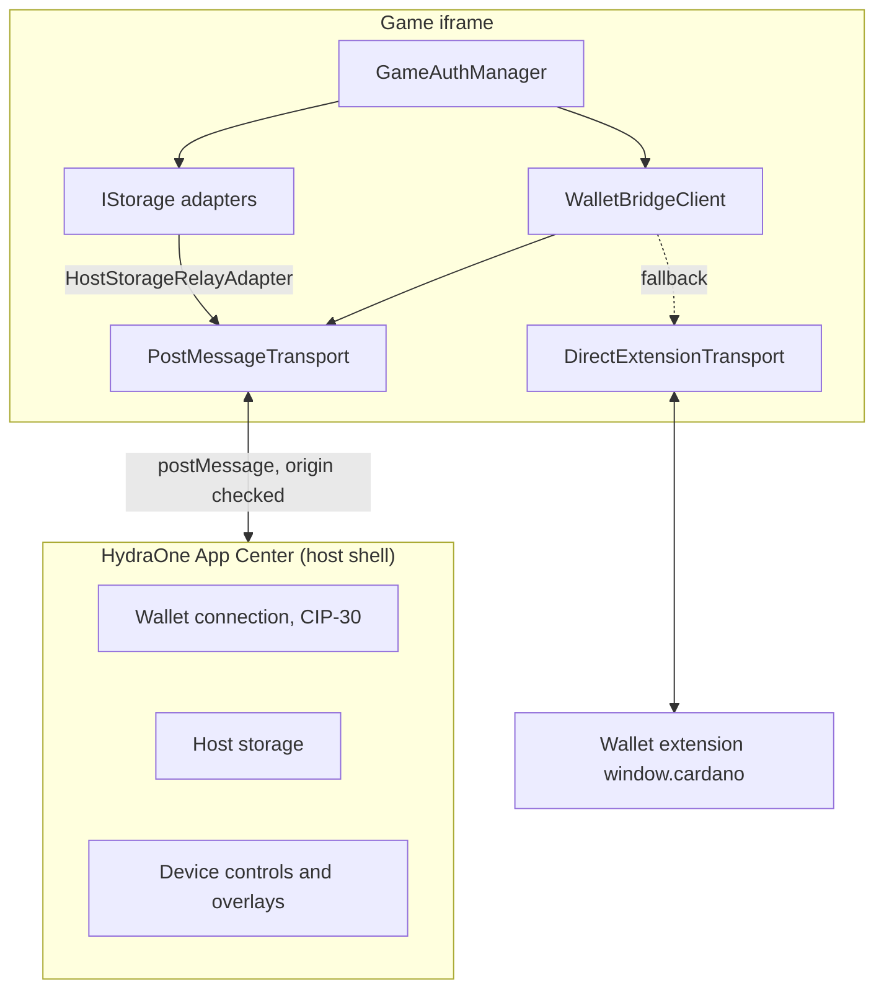
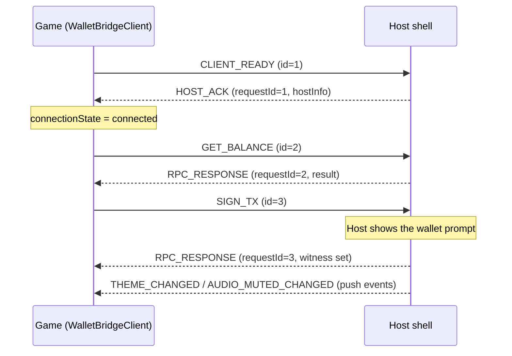

English | [Tiếng Việt](./vi/architecture.md)

# Architecture

## Two execution modes

The same client code runs in two environments.

1. **Embedded mode.** The game runs in an iframe inside the HydraOne App Center. The SDK talks to the host shell over `postMessage`. The host owns the wallet connection, so the game never sees private keys.
2. **Standalone mode.** The game runs in a normal browser tab. With `fallbackToExtension: true`, the SDK talks directly to a CIP-30 wallet extension on `window.cardano`.



## Core pieces

| Piece                      | Role                                                                                             |
| -------------------------- | ------------------------------------------------------------------------------------------------ |
| `WalletBridgeClient`       | Public entry point. Owns the connection state, request timeouts and host events.                 |
| `ITransport`               | Port with `send`, `onMessage` and optional `destroy`. Everything above it is transport-agnostic. |
| `PostMessageTransport`     | Iframe transport with origin and source validation and request/response correlation.             |
| `DirectExtensionTransport` | Talks to a CIP-30 extension and translates RPC messages into wallet calls.                       |
| `MockClientTransport`      | In-memory transport used by the simulator.                                                       |
| `IStorage`                 | Port for async key-value storage.                                                                |
| `GameAuthManager`          | CIP-8 login and JWT lifecycle on top of a client and a storage.                                  |

Ports (`ITransport`, `IStorage`) keep the core free of browser details, which is why the same client works against the iframe host, an extension and the simulator.

## Message protocol

Messages share one envelope:

```ts
interface BridgeMessage<T = unknown> {
  id: string; // correlation ID (UUID when available)
  type: string; // for example 'GET_BALANCE'
  payload?: T;
  timestamp: number;
  source: 'hydra-client' | 'hydra-host';
}
```

A request gets a unique `id`; the host answers with an `RPC_RESPONSE` (or `RPC_ERROR`) whose payload carries the same `requestId`. Responses are matched by ID, so concurrent requests cannot be mixed up, and a response for a request that has already timed out is discarded.



Message types: `CLIENT_READY`, `HOST_ACK`, `PING`, `GET_USED_ADDRESSES`, `GET_UTXOS`, `GET_BALANCE`, `GET_COLLATERAL`, `SIGN_TX`, `SUBMIT_TX`, `SIGN_DATA`, `AUDIO_MUTED_CHANGED`, `THEME_CHANGED`, `SET_ORIENTATION`, `TRIGGER_HAPTIC`, `REQUEST_DEPOSIT_MODAL`, `GET_PLAYER_PROFILE`, `AUTH_STATE_CHANGED`, `HOST_STORAGE_GET`, `HOST_STORAGE_SET`, `HOST_STORAGE_REMOVE`, `HOST_STORAGE_CLEAR`, `RPC_RESPONSE`, `RPC_ERROR`.

## Security model

- **Origin allow-listing.** `PostMessageTransport` accepts messages only from the configured `appCenterOrigin`. Anything else is rejected with `HydraSecurityError` before the payload is read.
- **Source check.** Inside an iframe, messages must also come from `window.parent` (disable with `checkIframeSource: false`).
- **No wildcard in production.** `appCenterOrigin: '*'` throws when `env` is `production`.
- **Targeted sends.** Outgoing messages use the configured origin as `targetOrigin`.
- **No key access.** In embedded mode all signing happens in the host's wallet.
- **Request timeouts.** Four tiers (handshake 3 s, ping 3 s, query 15 s, signing 120 s) keep a silent host from hanging the game. Each can be overridden.
- **Safe storage failure.** `HostStorageRelayAdapter` throws `ERR_STORAGE_UNAVAILABLE` instead of falling back to a storage where the session could leak or be wiped.
- **JWT handling.** The SDK decodes tokens and checks expiry, but never verifies signatures. Verification belongs to your backend.

## Package layout

One package, several entry points. Importing only what you need keeps your bundle small, and `sideEffects: false` lets bundlers drop the rest.

| Entry point                 | Contents                                                                                                      |
| --------------------------- | ------------------------------------------------------------------------------------------------------------- |
| `@hydraone/sdk`             | Client, transports, storage adapters, auth, errors, types and the diagnostics functions. About 23 KB gzipped. |
| `@hydraone/sdk/cardano`     | `bigint` ADA math, CBOR decoding, bech32 and hex helpers.                                                     |
| `@hydraone/sdk/react`       | `HydraOneProvider`, `useWallet`, `useHydraAuth`, `useHostStorage`.                                            |
| `@hydraone/sdk/vue`         | `useWalletBridgeClient`, `useGameAuth` and shared-instance setters.                                           |
| `@hydraone/sdk/simulator`   | `MockBridgeHost`, `DevToolsWidget`, dev shell. Development only.                                              |
| `@hydraone/sdk/diagnostics` | `checkBridgeHealth`, the individual checks and the report types.                                              |

`react` and `vue` are optional peer dependencies and are never bundled. The CLI (`create-hydraone-game`) ships in the same package.

The root entry re-exports everything from `/diagnostics`, because `client.checkHealth()` depends on it. Both import paths give you the same functions and types; `@hydraone/sdk/diagnostics` is the more explicit one when you only need diagnostics.
