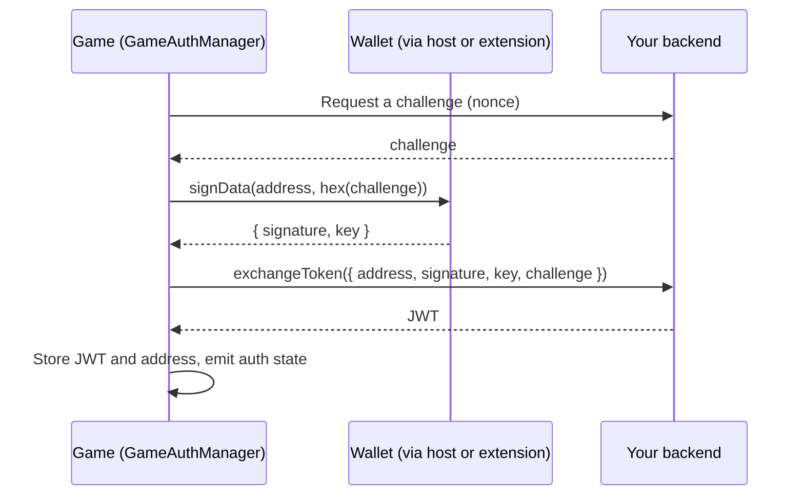

English | [Tiếng Việt](./vi/authentication.md)

# Authentication

The SDK implements a one-click login based on CIP-8 data signing. The player proves control of a wallet address by signing a challenge, your backend verifies the signature and issues a JWT, and the SDK stores and tracks that JWT.

## Flow



The SDK covers everything except the backend: you must issue the challenge and verify the signature yourself. The SDK never trusts a token it has not received from your `exchangeToken` callback or a `token` you pass in.

## Set up

```ts
import {
  WalletBridgeClient,
  PostMessageTransport,
  HostStorageRelayAdapter,
  GameAuthManager,
  parseJwt,
} from '@hydraone/sdk';

const transport = new PostMessageTransport({ appCenterOrigin: 'https://alpha.hydraone.app' });
const client = new WalletBridgeClient({ transport });
const storage = new HostStorageRelayAdapter({ transport });

const auth = new GameAuthManager({
  client,
  storage,
  exchangeToken: async ({ address, signature, key, challenge }) => {
    const res = await fetch('https://api.example.com/auth/verify', {
      method: 'POST',
      headers: { 'content-type': 'application/json' },
      body: JSON.stringify({ address, signature, key, challenge }),
    });
    const body = (await res.json()) as { token: string };
    return body.token;
  },
});

auth.onAuthStateChanged((state) => {
  console.log(state.isAuthenticated, state.address);
});

export async function login(nonce: string) {
  await client.init();
  const session = await auth.signIn({ challenge: nonce });
  return parseJwt<{ sub?: string }>(session.token ?? '').sub;
}

export async function restore() {
  const state = await auth.checkSession();
  return state.isAuthenticated ? await auth.getToken() : null;
}

export async function logout() {
  await auth.signOut();
}
```

`https://api.example.com` is a placeholder for your own backend.

`GameAuthManager` is an alias of `AuthManager`; both names are exported and identical.

## Options

| Option                  | Type                                                 | Default                  | Description                                                                                   |
| ----------------------- | ---------------------------------------------------- | ------------------------ | --------------------------------------------------------------------------------------------- |
| `client`                | `IAuthSignerClient`                                  | required                 | A `WalletBridgeClient` or any object with the same signing methods.                           |
| `storage`               | `IStorage`                                           | required                 | Where the JWT and address are persisted. Use `HostStorageRelayAdapter` inside the App Center. |
| `tokenStorageKey`       | `string`                                             | `hydra:sdk:auth:token`   | Storage key for the JWT.                                                                      |
| `addressStorageKey`     | `string`                                             | `hydra:sdk:auth:address` | Storage key for the player address.                                                           |
| `clockToleranceSeconds` | `number`                                             | `0`                      | Seconds of tolerance when checking JWT expiry.                                                |
| `exchangeToken`         | `(payload: AuthSignaturePayload) => Promise<string>` | none                     | Default function that turns a signature into a JWT.                                           |

## `signIn`

`signIn({ challenge, challengeEncoding?, address?, token?, exchangeToken?, signOptions? })`:

1. Resolves the address: `address` if given, otherwise the first used address, otherwise the change address. If none is available it throws `ERR_NOT_CONNECTED`.
2. Hex-encodes the challenge according to `challengeEncoding`:
   - `'auto'` (default): a `0x` prefix followed by an even number of hex digits is signed as those bytes; anything else is signed as its UTF-8 bytes. The choice never depends on the challenge length.
   - `'utf8'`: always the UTF-8 bytes of the string. Use this when your backend verifies the nonce as text.
   - `'hex'`: the string is hex (an optional `0x` is removed) and its bytes are signed; anything else throws `ERR_INVALID_PARAMS`. Use this when your backend verifies raw nonce bytes.
3. Calls `client.signData` and gets `{ signature, key }`.
4. Gets a JWT: the `token` you passed, else the result of `exchangeToken` (per call, then the one from the constructor).
5. Validates the JWT (not expired, decodable), stores it, and emits the new state.

Returns an `AuthSession` with `address`, `signature`, `key`, `challenge`, `payloadHex`, and, when a JWT was obtained, `token` and `claims`.

If you pass neither `token` nor an `exchangeToken`, no session is created: `signIn` only returns the signature, `token` is `undefined`, and the state stays signed out. Use this when you want to verify the signature yourself and then call `setSession(token)`.

Errors: `ERR_INVALID_PARAMS` for a missing or empty challenge, `ERR_NOT_CONNECTED` without an address, `ERR_USER_REJECTED` if the player cancels, `ERR_TIMEOUT` if the wallet does not respond, and `ERR_AUTH_EXPIRED` if the JWT you received is already expired.

## Session methods

| Method                        | Behavior                                                                                                                           |
| ----------------------------- | ---------------------------------------------------------------------------------------------------------------------------------- |
| `getToken()`                  | Returns the stored JWT, or `null`. An expired JWT is removed and the state changes to signed out with an `ERR_AUTH_EXPIRED` error. |
| `isAuthenticated()`           | `true` when a valid JWT is stored.                                                                                                 |
| `getClaims<T>()`              | Decoded JWT payload, or `null`.                                                                                                    |
| `getAuthAddress()`            | Address of the current session, or `null`.                                                                                         |
| `checkSession()`              | Re-validates storage and returns the current `AuthState`. Call it on startup.                                                      |
| `setSession(token, address?)` | Starts a session from a JWT you already have. Rejects expired or malformed tokens.                                                 |
| `signOut()`                   | Removes the JWT and address from storage and emits a signed-out state.                                                             |
| `onAuthStateChanged(handler)` | Subscribes to state changes. Returns an unsubscribe function.                                                                      |
| `state`                       | Snapshot of the in-memory `AuthState`.                                                                                             |
| `destroy()`                   | Removes listeners. Call when the game shuts down.                                                                                  |

`AuthState` is `{ isAuthenticated, token, address, claims?, error? }`.

If the host shell reports `AUTH_STATE_CHANGED` with `isAuthenticated: false` (for example the player signed out in the App Center), the manager signs out locally too.

## JWT helpers

```ts
import { parseJwt, isJwtExpired } from '@hydraone/sdk';

const claims = parseJwt<{ sub: string; exp: number }>(token);
const expired = isJwtExpired(token, 30); // 30 seconds of clock tolerance
```

These helpers only decode the token. They do not verify the signature: that is your backend's job.

## Security notes

- Always generate the challenge on your server, make it single-use and short-lived, and bind it to the session. A challenge chosen by the client can be replayed.
- Verify the CIP-8 signature and the key-to-address binding on the backend before issuing the JWT.
- Storage inside a cross-origin iframe may be blocked or wiped by Safari. Use `HostStorageRelayAdapter` so the session survives reloads. If the host is unreachable the adapter throws `ERR_STORAGE_UNAVAILABLE` rather than silently writing the token to a less safe place. See the [Safari ITP guide](./guides/safari-itp.md).
