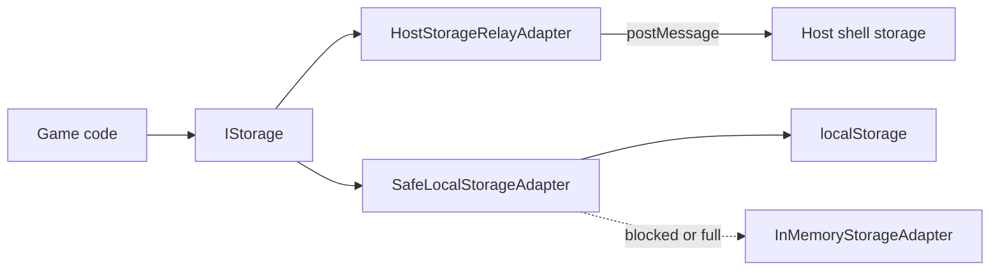

English | [Tiếng Việt](../vi/guides/safari-itp.md)

# Safari ITP and host storage

## The problem

Safari (macOS, iOS and WebKit web views) applies Intelligent Tracking Prevention to third-party contexts. A game embedded as a cross-origin iframe in the HydraOne App Center is a third-party context, so Safari may:

- Partition `localStorage`, `sessionStorage`, IndexedDB and cookies per top-level site, so data is not shared with a visit to the game's own site.
- Block storage access with a `SecurityError`.
- Delete script-writable storage after a period without user interaction. WebKit documents a cap on how long such data survives; check the current WebKit tracking-prevention notes for the exact duration.

For a game this means players lose their login and progress after a reload or after a few days.

## The solution

Keep session data on the host shell, which runs in a first-party context, and reach it over `postMessage`. `HostStorageRelayAdapter` is an `IStorage` implementation that sends `HOST_STORAGE_GET`, `HOST_STORAGE_SET`, `HOST_STORAGE_REMOVE` and `HOST_STORAGE_CLEAR` messages to the host.



The SDK does not switch between them for you at runtime. You choose one when you build your storage, as in the example below, and the choice is usually "relay when embedded, local storage otherwise".

```ts
import {
  PostMessageTransport,
  SafeLocalStorageAdapter,
  HostStorageRelayAdapter,
  InMemoryStorageAdapter,
  buildStorageKey,
  type IStorage,
} from '@hydraone/sdk';

const transport = new PostMessageTransport({ appCenterOrigin: 'https://alpha.hydraone.app' });

export function pickStorage(insideAppCenter: boolean): IStorage {
  if (insideAppCenter) return new HostStorageRelayAdapter({ transport, timeoutMs: 10_000 });
  return new SafeLocalStorageAdapter({
    fallbackStorage: new InMemoryStorageAdapter(),
    onFallback: (err) => console.warn('localStorage unavailable, using memory', err),
  });
}

export async function save(storage: IStorage) {
  const key = buildStorageKey('session', 'lastLevel');
  await storage.setItem(key, '7');
  return storage.getItem(key);
}
```

Pass the same storage to `GameAuthManager` so the JWT survives reloads. `WalletBridgeClient.isStandaloneBrowser()` tells you whether the game runs outside an iframe.

## Behavior to know

- **Fail closed.** If the host does not answer, or reports a storage failure, the relay throws `HydraStorageError` (`ERR_STORAGE_UNAVAILABLE`). It does not fall back to local storage, because that could write the session token to a place Safari wipes or that other scripts can read. Catch the error and ask the player to sign in again.
- **`SafeLocalStorageAdapter` falls back to memory** when `localStorage` is missing, blocked (`SecurityError`), full, or the code runs on the server. The data is then lost on reload. `adapter.isUsingFallback` tells you it happened and `onFallback` is called once.
- **Key conventions.** Use `buildStorageKey('auth' | 'session', name)` to get keys of the form `hydra:sdk:<namespace>:<name>`. The SDK's own auth data uses `hydra:sdk:auth:*`. `clear()` removes only keys starting with `hydra:sdk:`.
- **Async API.** `IStorage` methods return promises even for local storage, so code works with both adapters.
- **Isolation between games is the host's responsibility.** The relay sends the key as you gave it. The host decides how to scope keys per game, so do not rely on the SDK to separate games.

## Required iframe attributes

For `postMessage` origin checks and storage to work, the host must embed the game with both `allow-scripts` and `allow-same-origin` in the sandbox:

```html
<iframe
  src="https://mygame.example"
  sandbox="allow-scripts allow-same-origin allow-forms allow-popups allow-modals"
  allow="clipboard-write; accelerometer; gyroscope"
></iframe>
```

Without `allow-same-origin` the iframe gets an opaque origin (`null`), and the diagnostics report it as a failure.

## Test it locally

Use the [simulator](../testing-your-integration.md) to reproduce the problem on any browser:

```ts
import { MockBridgeHost } from '@hydraone/sdk/simulator';

const host = new MockBridgeHost();
host.setStorageBlock(true); // host storage requests now fail with ERR_STORAGE_UNAVAILABLE
```

In the DevTools widget, the Safari ITP switch does the same and also makes `localStorage` throw `SecurityError`. Reload and confirm your game recovers gracefully.

Then run the health check against the real host:

```ts
import { WalletBridgeClient, PostMessageTransport } from '@hydraone/sdk';
import { checkBridgeHealth } from '@hydraone/sdk/diagnostics';

const client = new WalletBridgeClient({
  transport: new PostMessageTransport({ appCenterOrigin: 'https://alpha.hydraone.app' }),
});
const report = await checkBridgeHealth(client);
const storage = report.checks.filter((c) => c.id.startsWith('storage-'));
console.log(storage);
```

## Checklist

- Do not call `localStorage` directly without `try/catch`; use an `IStorage` adapter.
- Use `HostStorageRelayAdapter` when embedded and give it a transport that is already connected to the host.
- Handle `ERR_STORAGE_UNAVAILABLE` in the login flow.
- Keep stored values small; browsers limit storage to a few megabytes.
- Verify the iframe sandbox attributes.
- Run the game with Safari ITP simulation on before every release.
