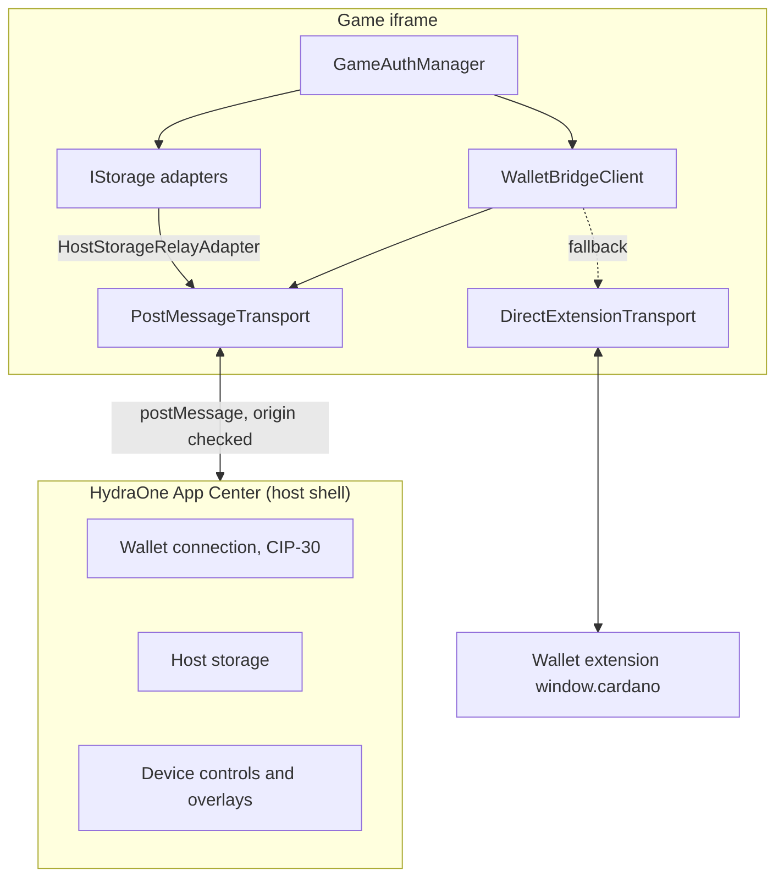
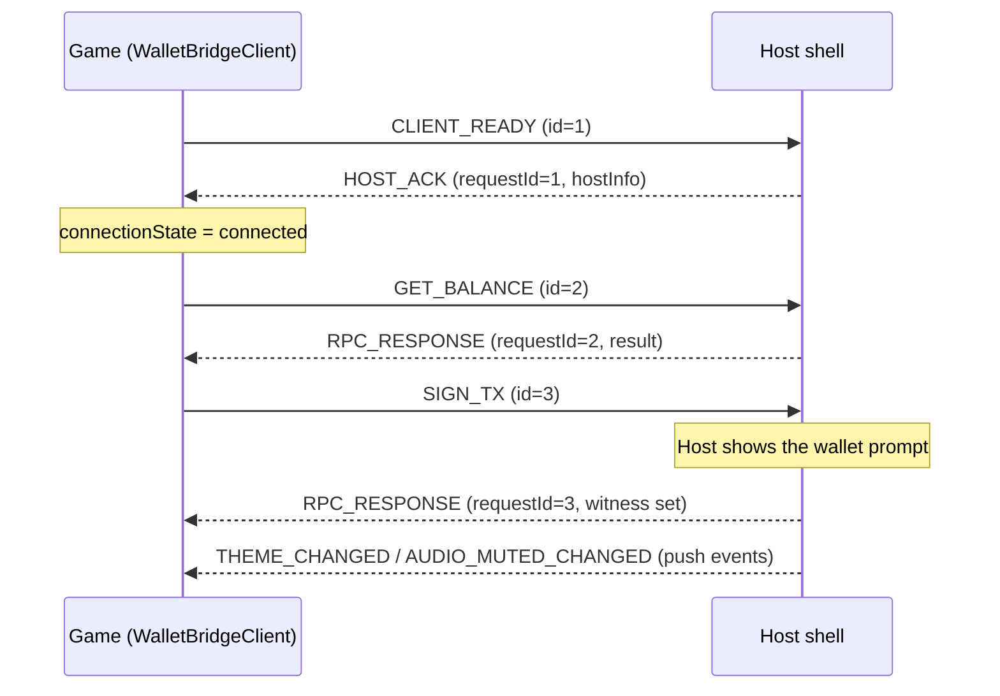

[English](../architecture.md) | Tiếng Việt

> Bản dịch này đồng bộ với bản tiếng Anh tại commit 63aa236. Khi hai bản khác nhau, bản tiếng Anh là bản chính.

# Kiến trúc

## Hai chế độ thực thi

Cùng một đoạn code client chạy được trong hai môi trường.

1. **Embedded mode.** Game chạy trong iframe bên trong HydraOne App Center. SDK trao đổi với host shell qua `postMessage`. Host nắm giữ kết nối ví nên game không bao giờ thấy private key.
2. **Standalone mode.** Game chạy trong một tab trình duyệt thông thường. Với `fallbackToExtension: true`, SDK làm việc trực tiếp với extension ví CIP-30 trên `window.cardano`.



## Các thành phần cốt lõi

| Thành phần                 | Vai trò                                                                                                       |
| -------------------------- | ------------------------------------------------------------------------------------------------------------- |
| `WalletBridgeClient`       | Điểm vào công khai. Quản lý trạng thái kết nối, timeout của request và các sự kiện từ host.                   |
| `ITransport`               | Port gồm `send`, `onMessage` và `destroy` (tùy chọn). Mọi thứ phía trên nó đều không phụ thuộc vào transport. |
| `PostMessageTransport`     | Transport cho iframe, có kiểm tra origin và source cùng việc ghép cặp request/response theo correlation.      |
| `DirectExtensionTransport` | Làm việc với extension CIP-30 và chuyển các thông điệp RPC thành lời gọi ví.                                  |
| `MockClientTransport`      | Transport trong bộ nhớ, được simulator sử dụng.                                                               |
| `IStorage`                 | Port cho lưu trữ key-value bất đồng bộ.                                                                       |
| `GameAuthManager`          | Đăng nhập CIP-8 và vòng đời JWT, xây trên một client và một storage.                                          |

Các port (`ITransport`, `IStorage`) giữ cho phần lõi không dính đến chi tiết của trình duyệt. Nhờ vậy cùng một client chạy được với iframe host, extension và simulator.

## Giao thức thông điệp

Mọi thông điệp dùng chung một envelope:

```ts
interface BridgeMessage<T = unknown> {
  id: string; // correlation ID (UUID when available)
  type: string; // for example 'GET_BALANCE'
  payload?: T;
  timestamp: number;
  source: 'hydra-client' | 'hydra-host';
}
```

Mỗi request có một `id` duy nhất; host trả lời bằng `RPC_RESPONSE` (hoặc `RPC_ERROR`) có payload mang cùng `requestId`. Response được ghép theo ID nên các request đồng thời không bị lẫn vào nhau, và response của một request đã timeout sẽ bị bỏ đi.



Các loại thông điệp: `CLIENT_READY`, `HOST_ACK`, `PING`, `GET_USED_ADDRESSES`, `GET_UTXOS`, `GET_BALANCE`, `GET_COLLATERAL`, `SIGN_TX`, `SUBMIT_TX`, `SIGN_DATA`, `AUDIO_MUTED_CHANGED`, `THEME_CHANGED`, `SET_ORIENTATION`, `TRIGGER_HAPTIC`, `REQUEST_DEPOSIT_MODAL`, `GET_PLAYER_PROFILE`, `AUTH_STATE_CHANGED`, `HOST_STORAGE_GET`, `HOST_STORAGE_SET`, `HOST_STORAGE_REMOVE`, `HOST_STORAGE_CLEAR`, `RPC_RESPONSE`, `RPC_ERROR`.

## Mô hình bảo mật

- **Allow-list origin.** `PostMessageTransport` chỉ nhận thông điệp từ `appCenterOrigin` đã cấu hình. Mọi thứ khác bị từ chối bằng `HydraSecurityError` trước khi payload được đọc.
- **Kiểm tra source.** Bên trong iframe, thông điệp còn phải đến từ `window.parent` (tắt bằng `checkIframeSource: false`).
- **Không dùng wildcard ở production.** `appCenterOrigin: '*'` sẽ ném lỗi khi `env` là `production`.
- **Gửi có đích.** Thông điệp gửi đi dùng origin đã cấu hình làm `targetOrigin`.
- **Không truy cập key.** Ở embedded mode, mọi thao tác ký đều diễn ra trong ví của host.
- **Timeout cho request.** Bốn mức (handshake 3 s, ping 3 s, query 15 s, signing 120 s) giúp một host im lặng không làm treo game. Mỗi mức đều có thể ghi đè.
- **Lỗi storage an toàn.** `HostStorageRelayAdapter` ném `ERR_STORAGE_UNAVAILABLE` thay vì chuyển sang một storage mà phiên đăng nhập có thể bị lộ hoặc bị xóa.
- **Xử lý JWT.** SDK giải mã token và kiểm tra thời hạn nhưng không bao giờ xác minh chữ ký. Việc xác minh thuộc về backend của bạn.

## Cấu trúc package

Một package, nhiều entry point. Chỉ import những gì bạn cần sẽ giữ bundle nhỏ, và `sideEffects: false` cho phép bundler loại bỏ phần còn lại.

| Entry point                 | Nội dung                                                                                               |
| --------------------------- | ------------------------------------------------------------------------------------------------------ |
| `@hydraone/sdk`             | Client, transport, storage adapter, auth, lỗi, type và các hàm diagnostics. Khoảng 23 KB sau khi gzip. |
| `@hydraone/sdk/cardano`     | Phép tính ADA bằng `bigint`, giải mã CBOR, các helper bech32 và hex.                                   |
| `@hydraone/sdk/react`       | `HydraOneProvider`, `useWallet`, `useHydraAuth`, `useHostStorage`.                                     |
| `@hydraone/sdk/vue`         | `useWalletBridgeClient`, `useGameAuth` và các hàm setter cho instance dùng chung.                      |
| `@hydraone/sdk/simulator`   | `MockBridgeHost`, `DevToolsWidget`, dev shell. Chỉ dùng khi phát triển.                                |
| `@hydraone/sdk/diagnostics` | `checkBridgeHealth`, các check riêng lẻ và các type của report.                                        |

`react` và `vue` là peer dependency tùy chọn và không bao giờ được đóng gói vào bundle. CLI (`create-hydraone-game`) nằm trong cùng package.

Entry gốc re-export mọi thứ từ `/diagnostics` vì `client.checkHealth()` phụ thuộc vào nó. Cả hai đường import cho ra cùng các hàm và type; `@hydraone/sdk/diagnostics` tường minh hơn khi bạn chỉ cần diagnostics.
