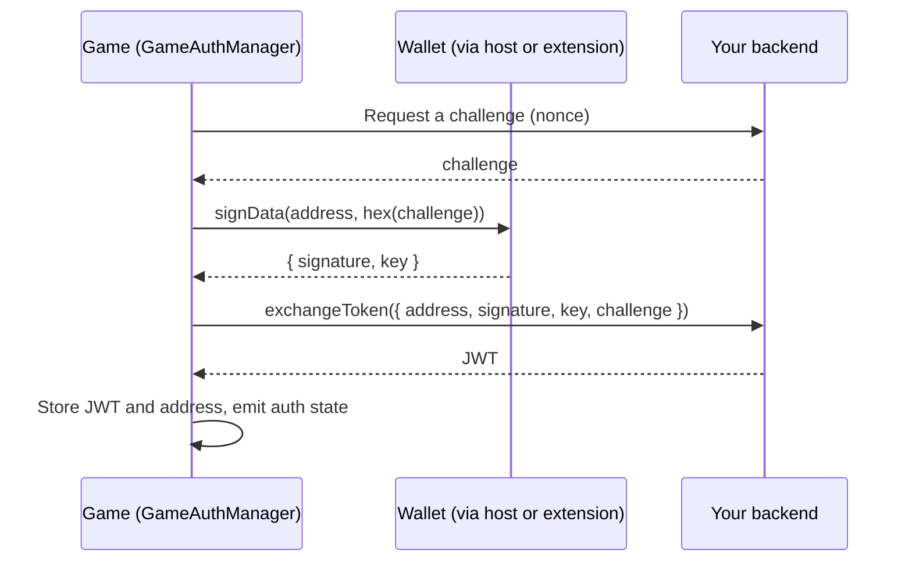

[English](../authentication.md) | Tiếng Việt

> Bản dịch này đồng bộ với bản tiếng Anh tại commit 63aa236. Khi hai bản khác nhau, bản tiếng Anh là bản chính.

# Xác thực

SDK triển khai đăng nhập một chạm dựa trên việc ký dữ liệu theo CIP-8. Người chơi chứng minh quyền kiểm soát một địa chỉ ví bằng cách ký một challenge, backend của bạn xác minh chữ ký và cấp JWT, còn SDK lưu và theo dõi JWT đó.

## Luồng xử lý



SDK lo mọi thứ trừ backend: bạn phải tự cấp challenge và tự xác minh chữ ký. SDK không bao giờ tin một token mà nó không nhận được từ callback `exchangeToken` của bạn hoặc từ `token` bạn truyền vào.

## Thiết lập

```ts
import {
  WalletBridgeClient,
  PostMessageTransport,
  HostStorageRelayAdapter,
  GameAuthManager,
  parseJwt,
} from '@hydraone/sdk';

const transport = new PostMessageTransport({ appCenterOrigin: 'https://alpha.hydraone.app' });
const client = new WalletBridgeClient({ transport });
const storage = new HostStorageRelayAdapter({ transport });

const auth = new GameAuthManager({
  client,
  storage,
  exchangeToken: async ({ address, signature, key, challenge }) => {
    const res = await fetch('https://api.example.com/auth/verify', {
      method: 'POST',
      headers: { 'content-type': 'application/json' },
      body: JSON.stringify({ address, signature, key, challenge }),
    });
    const body = (await res.json()) as { token: string };
    return body.token;
  },
});

auth.onAuthStateChanged((state) => {
  console.log(state.isAuthenticated, state.address);
});

export async function login(nonce: string) {
  await client.init();
  const session = await auth.signIn({ challenge: nonce });
  return parseJwt<{ sub?: string }>(session.token ?? '').sub;
}

export async function restore() {
  const state = await auth.checkSession();
  return state.isAuthenticated ? await auth.getToken() : null;
}

export async function logout() {
  await auth.signOut();
}
```

`https://api.example.com` là địa chỉ giữ chỗ cho backend của bạn.

`GameAuthManager` là bí danh của `AuthManager`; cả hai tên đều được export và giống hệt nhau.

## Tùy chọn

| Tùy chọn                | Kiểu                                                 | Mặc định                 | Mô tả                                                                        |
| ----------------------- | ---------------------------------------------------- | ------------------------ | ---------------------------------------------------------------------------- |
| `client`                | `IAuthSignerClient`                                  | bắt buộc                 | Một `WalletBridgeClient` hoặc bất kỳ object nào có cùng các phương thức ký.  |
| `storage`               | `IStorage`                                           | bắt buộc                 | Nơi lưu JWT và địa chỉ. Dùng `HostStorageRelayAdapter` bên trong App Center. |
| `tokenStorageKey`       | `string`                                             | `hydra:sdk:auth:token`   | Storage key cho JWT.                                                         |
| `addressStorageKey`     | `string`                                             | `hydra:sdk:auth:address` | Storage key cho địa chỉ của người chơi.                                      |
| `clockToleranceSeconds` | `number`                                             | `0`                      | Số giây dung sai khi kiểm tra hạn của JWT.                                   |
| `exchangeToken`         | `(payload: AuthSignaturePayload) => Promise<string>` | không có                 | Hàm mặc định biến chữ ký thành JWT.                                          |

## `signIn`

`signIn({ challenge, address?, token?, exchangeToken?, signOptions? })`:

1. Xác định địa chỉ: dùng `address` nếu được truyền, nếu không thì dùng used address đầu tiên, nếu không nữa thì dùng change address. Nếu không có địa chỉ nào, nó ném `ERR_NOT_CONNECTED`.
2. Mã hóa hex cho challenge. Challenge đã là hex (có hoặc không có `0x`) thì được dùng nguyên.
3. Gọi `client.signData` và nhận `{ signature, key }`.
4. Lấy JWT: dùng `token` bạn truyền vào, nếu không thì dùng kết quả của `exchangeToken` (theo từng lần gọi, sau đó đến hàm từ constructor).
5. Kiểm tra JWT (chưa hết hạn, giải mã được), lưu lại và phát trạng thái mới.

Trả về một `AuthSession` gồm `address`, `signature`, `key`, `challenge`, `payloadHex` và, khi đã lấy được JWT, thêm `token` và `claims`.

Nếu bạn không truyền cả `token` lẫn `exchangeToken`, sẽ không có phiên nào được tạo: `signIn` chỉ trả về chữ ký, `token` là `undefined` và trạng thái vẫn là chưa đăng nhập. Dùng cách này khi bạn muốn tự xác minh chữ ký rồi mới gọi `setSession(token)`.

Các lỗi: `ERR_INVALID_PARAMS` khi thiếu hoặc rỗng challenge, `ERR_NOT_CONNECTED` khi không có địa chỉ, `ERR_USER_REJECTED` nếu người chơi hủy, `ERR_TIMEOUT` nếu ví không phản hồi, và `ERR_AUTH_EXPIRED` nếu JWT nhận được đã hết hạn.

## Các phương thức quản lý phiên

| Phương thức                   | Hành vi                                                                                                                    |
| ----------------------------- | -------------------------------------------------------------------------------------------------------------------------- |
| `getToken()`                  | Trả về JWT đã lưu, hoặc `null`. JWT hết hạn sẽ bị xóa và trạng thái chuyển sang chưa đăng nhập kèm lỗi `ERR_AUTH_EXPIRED`. |
| `isAuthenticated()`           | `true` khi có một JWT hợp lệ được lưu.                                                                                     |
| `getClaims<T>()`              | Payload JWT đã giải mã, hoặc `null`.                                                                                       |
| `getAuthAddress()`            | Địa chỉ của phiên hiện tại, hoặc `null`.                                                                                   |
| `checkSession()`              | Kiểm tra lại storage và trả về `AuthState` hiện tại. Gọi hàm này khi khởi động.                                            |
| `setSession(token, address?)` | Bắt đầu một phiên từ JWT bạn đã có. Từ chối token hết hạn hoặc sai định dạng.                                              |
| `signOut()`                   | Xóa JWT và địa chỉ khỏi storage và phát trạng thái chưa đăng nhập.                                                         |
| `onAuthStateChanged(handler)` | Đăng ký nhận thay đổi trạng thái. Trả về một hàm hủy đăng ký.                                                              |
| `state`                       | Bản chụp `AuthState` trong bộ nhớ.                                                                                         |
| `destroy()`                   | Gỡ các listener. Gọi khi game tắt.                                                                                         |

`AuthState` là `{ isAuthenticated, token, address, claims?, error? }`.

Nếu host shell báo `AUTH_STATE_CHANGED` với `isAuthenticated: false` (ví dụ người chơi đăng xuất trong App Center), manager cũng tự đăng xuất cục bộ.

## Các helper JWT

```ts
import { parseJwt, isJwtExpired } from '@hydraone/sdk';

const claims = parseJwt<{ sub: string; exp: number }>(token);
const expired = isJwtExpired(token, 30); // 30 seconds of clock tolerance
```

Các helper này chỉ giải mã token. Chúng không xác minh chữ ký: đó là việc của backend.

## Lưu ý bảo mật

- Luôn tạo challenge trên server, để dùng một lần và có thời hạn ngắn, đồng thời gắn nó với phiên. Challenge do client tự chọn có thể bị phát lại.
- Xác minh chữ ký CIP-8 và việc key khớp với địa chỉ ở backend trước khi cấp JWT.
- Storage bên trong iframe cross-origin có thể bị Safari chặn hoặc xóa. Dùng `HostStorageRelayAdapter` để phiên tồn tại sau khi tải lại trang. Nếu không liên lạc được với host, adapter ném `ERR_STORAGE_UNAVAILABLE` thay vì âm thầm ghi token vào một nơi kém an toàn hơn. Xem [hướng dẫn Safari ITP](./guides/safari-itp.md).
