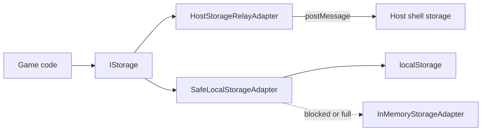

[English](../../guides/safari-itp.md) | Tiếng Việt

> Bản dịch này đồng bộ với bản tiếng Anh tại commit 63aa236. Khi hai bản khác nhau, bản tiếng Anh là bản chính.

# Safari ITP và host storage

## Vấn đề

Safari (macOS, iOS và các WebKit web view) áp dụng Intelligent Tracking Prevention cho các ngữ cảnh third-party. Một game được nhúng dưới dạng iframe cross-origin trong HydraOne App Center là ngữ cảnh third-party, nên Safari có thể:

- Phân vùng `localStorage`, `sessionStorage`, IndexedDB và cookie theo từng top-level site, khiến dữ liệu không được chia sẻ với lần truy cập trực tiếp vào site của game.
- Chặn truy cập storage bằng `SecurityError`.
- Xóa storage mà script có thể ghi sau một khoảng thời gian người dùng không tương tác. WebKit có tài liệu về giới hạn thời gian dữ liệu này tồn tại; hãy xem ghi chú tracking-prevention hiện hành của WebKit để biết khoảng thời gian chính xác.

Với một game, điều này nghĩa là người chơi mất phiên đăng nhập và tiến trình sau khi tải lại trang hoặc sau vài ngày.

## Giải pháp

Giữ dữ liệu phiên trên host shell, nơi chạy trong ngữ cảnh first-party, và truy cập nó qua `postMessage`. `HostStorageRelayAdapter` là một bản triển khai `IStorage` gửi các message `HOST_STORAGE_GET`, `HOST_STORAGE_SET`, `HOST_STORAGE_REMOVE` và `HOST_STORAGE_CLEAR` tới host.



SDK không tự chuyển đổi giữa các adapter lúc runtime. Bạn chọn một adapter khi xây dựng storage, như ví dụ bên dưới, và lựa chọn thường là "dùng relay khi được nhúng, ngược lại dùng local storage".

```ts
import {
  PostMessageTransport,
  SafeLocalStorageAdapter,
  HostStorageRelayAdapter,
  InMemoryStorageAdapter,
  buildStorageKey,
  type IStorage,
} from '@hydraone/sdk';

const transport = new PostMessageTransport({ appCenterOrigin: 'https://alpha.hydraone.app' });

export function pickStorage(insideAppCenter: boolean): IStorage {
  if (insideAppCenter) return new HostStorageRelayAdapter({ transport, timeoutMs: 10_000 });
  return new SafeLocalStorageAdapter({
    fallbackStorage: new InMemoryStorageAdapter(),
    onFallback: (err) => console.warn('localStorage unavailable, using memory', err),
  });
}

export async function save(storage: IStorage) {
  const key = buildStorageKey('session', 'lastLevel');
  await storage.setItem(key, '7');
  return storage.getItem(key);
}
```

Hãy truyền cùng storage đó cho `GameAuthManager` để JWT tồn tại qua các lần tải lại. `WalletBridgeClient.isStandaloneBrowser()` cho bạn biết game có đang chạy bên ngoài iframe hay không.

## Hành vi cần biết

- **Fail closed.** Nếu host không phản hồi, hoặc báo lỗi storage, relay ném `HydraStorageError` (`ERR_STORAGE_UNAVAILABLE`). Nó không fallback sang local storage, vì như vậy có thể ghi session token vào nơi Safari sẽ xóa hoặc nơi các script khác đọc được. Hãy bắt lỗi này và yêu cầu người chơi đăng nhập lại.
- **`SafeLocalStorageAdapter` fallback sang bộ nhớ** khi `localStorage` không tồn tại, bị chặn (`SecurityError`), đã đầy, hoặc khi code chạy trên server. Khi đó dữ liệu sẽ mất sau khi tải lại. `adapter.isUsingFallback` cho biết điều đó đã xảy ra và `onFallback` được gọi một lần.
- **Quy ước đặt key.** Dùng `buildStorageKey('auth' | 'session', name)` để có key dạng `hydra:sdk:<namespace>:<name>`. Dữ liệu auth của chính SDK dùng `hydra:sdk:auth:*`. `clear()` chỉ xóa các key bắt đầu bằng `hydra:sdk:`.
- **API bất đồng bộ.** Các method của `IStorage` trả về promise ngay cả với local storage, nên code chạy được với cả hai adapter.
- **Việc cô lập giữa các game thuộc trách nhiệm của host.** Relay gửi key đúng như bạn đưa vào. Host quyết định cách phân vùng key cho từng game, vì vậy đừng trông chờ SDK tách biệt các game.

## Thuộc tính iframe bắt buộc

Để kiểm tra origin của `postMessage` và storage hoạt động, host phải nhúng game với cả `allow-scripts` và `allow-same-origin` trong sandbox:

```html
<iframe
  src="https://mygame.example"
  sandbox="allow-scripts allow-same-origin allow-forms allow-popups allow-modals"
  allow="clipboard-write; accelerometer; gyroscope"
></iframe>
```

Nếu thiếu `allow-same-origin`, iframe sẽ có origin mờ (`null`), và công cụ chẩn đoán sẽ báo đây là một lỗi.

## Thử nghiệm cục bộ

Dùng [simulator](../testing-your-integration.md) để tái hiện vấn đề trên bất kỳ trình duyệt nào:

```ts
import { MockBridgeHost } from '@hydraone/sdk/simulator';

const host = new MockBridgeHost();
host.setStorageBlock(true); // host storage requests now fail with ERR_STORAGE_UNAVAILABLE
```

Trong widget DevTools, công tắc Safari ITP cũng làm điều tương tự và còn khiến `localStorage` ném `SecurityError`. Hãy tải lại trang và xác nhận game của bạn phục hồi một cách êm đẹp.

Sau đó chạy health check với host thật:

```ts
import { WalletBridgeClient, PostMessageTransport } from '@hydraone/sdk';
import { checkBridgeHealth } from '@hydraone/sdk/diagnostics';

const client = new WalletBridgeClient({
  transport: new PostMessageTransport({ appCenterOrigin: 'https://alpha.hydraone.app' }),
});
const report = await checkBridgeHealth(client);
const storage = report.checks.filter((c) => c.id.startsWith('storage-'));
console.log(storage);
```

## Checklist

- Không gọi `localStorage` trực tiếp mà không có `try/catch`; hãy dùng một `IStorage` adapter.
- Dùng `HostStorageRelayAdapter` khi được nhúng và đưa cho nó một transport đã kết nối với host.
- Xử lý `ERR_STORAGE_UNAVAILABLE` trong luồng đăng nhập.
- Giữ các giá trị lưu trữ nhỏ; trình duyệt giới hạn storage ở vài megabyte.
- Kiểm tra các thuộc tính sandbox của iframe.
- Chạy game với mô phỏng Safari ITP được bật trước mỗi lần phát hành.
